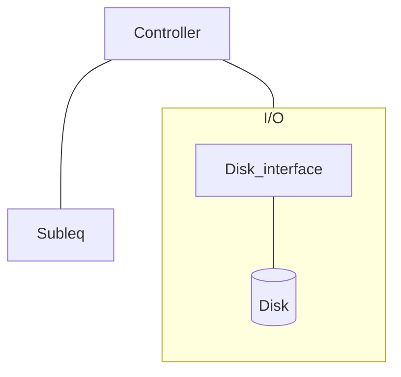
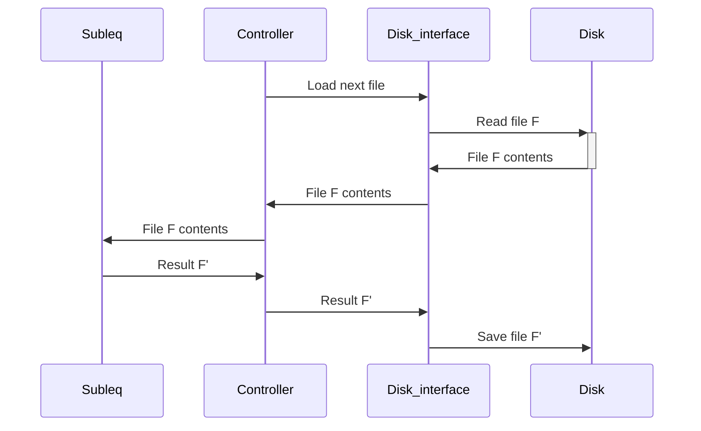

# Subleq

<p>
  
</p>

Subleq is a microprocessor implementation with a single instruction (OISC). The
project also features a tool that produces RAM images whose subleq-computation
doesn't loop, which we use as input tests.

## High-level description of the project

The goal of the project is to implement a subleq microprocessor in bopkit. This
microprocessor should be able to compute the image of a subleq program contained
in its internal RAM memory.

So we can test it and run demos easily, we'll drive its execution using an
external controller, which can partially be written in software. The goal of the
controller is to be able to read memory files from disk, loads them into the
subleq machine, wait for it to finish its computation, retrieves the subleq
memory contents to save it to disk, and repeat with another file.

So it's more fun to look at, our simulation will make use of Graphics windows
that show the memory cells being read and written to.

To see all the files of this project, check out the source code on
[GitHub](https://github.com/mbarbin/bopkit/tree/main/project/subleq).

### Origin

This project was written by Mehdi Bouaziz and Mathieu Barbin in 2008, as part of
a class on digital circuits with Prof. David Naccache.

## Subleq

OISC stands for One Instruction Set Computer, a machine providing only one
instruction. Subleq refers to a kind of OISC where the one instruction is
"SUBtract and branch if Less-than or EQual to zero", conventionally abbreviated
to subleq. There're multiple variants of subleq, so we'll describe the one we've
used in this project here:

Let `M` be the RAM memory of the microprocessor, and `pc` (Program Counter) a
register holding the line of code of the instruction currently executed. The
subleq(pc) instruction is defined as follows:

```
subleq(M, pc):
  a <- M[pc]        // Read &a
  b <- M[pc+1]      // Read &b
  r <- M[b] - M[a]  // Compute *b minus *a
  M[b] <- r         // Store the result at &b
  // Jump
  if r <= 0 then
    pc <- M[pc+2]   // If r <= 0 jump to address contained in pc+2
  else
    pc <- pc+3      // Otherwise continue with the next 3 operands
  fi
```

Note that this microprocessor doesn't have the traditional ROM with the code to
execute, and RAM with its internally memory. Its memory contains the code! (the
operands), and running the program modifies the memory, so in fact the program
itself.

By convention, we stop the program if it ever reaches a state where `pc=1`.
Otherwise, a program loops forever.

Subleq programs may be hard to predict. We've heard somebody refer to the subleq
machine as the [Brainfuck](https://en.wikipedia.org/wiki/Brainfuck) of Hardware,
I guess you can see why they would say that!

### Simulator

The first thing we've implemented is a software program that can read a memory
contents from a file, and execute it through the subleq process. This subleq
simulator prints the state of the memory when the program terminates, or
produces an error if it detects that the program loops.

For example, let's consider the following RAM image (architecture 4 bits):

```sh
$ cat ar4-01.input
0000
1111
0010
0010
1110
1011
1100
1001
0011
0110
1011
0110
1110
1001
0101
1100
```

You can invoke the simulator with this command:

```sh
$ subleq simulate -ar 4 ar4-01.input
Subleq simulator: running...
[ ;-) ] Program terminated after 9 steps. IM 15.62 % diff.
0011
1111
0000
0010
1101
1011
1100
0100
0011
0010
1011
0110
1100
1001
0101
1100
```

In addition to the final state of the memory, the simulator prints to stderr as
a percentage how different is that final memory from its initial state (here
15.62% of the bits have changed through the subleq execution).

If a cycle was detected, the simulator would exit 1. Let's check it out on a
file which we know doesn't terminate:


```sh
$ subleq simulate -ar 4 cycle01.input
Subleq simulator: running...
[ ;-( ] Cycle detected : Aborting computation.
Program does not terminate
[1]
```

### Debugger

To run a subleq program step by step while looking at the memory, we've
implemented a debugger mode. To run the debugger, simply add the option `-g` to
the command line.

<!-- $MDX skip -->
```sh
$ subleq simulate -ar 4 ar4-01.input -g
```

<p>
  
</p>


### Generator

For the project, we've shied away from actually attempting to write "real"
subleq programs, and simply implemented a random generator to constitute a
collection of tests cases. Check it out with:

<!-- $MDX skip -->
```sh
$ subleq generate --help
```

## Architecture

The project consists of 3 components:

1. [Controller](https://github.com/mbarbin/bopkit/tree/main/project/subleq/circuit/controller.ml)
2. [Disk_interface](https://github.com/mbarbin/bopkit/tree/main/project/subleq/circuit/disk_interface.ml)
3. [Subleq](https://github.com/mbarbin/bopkit/tree/main/project/subleq/circuit/subleq.bop)



The `Disk_interface` component has the ability to read and write files on disk,
while the 2 others only run computation from local memory.

### Original project

In the original project, the controller and disk interface were actually run on
a distant machine, and resulted from the simulated execution of a 4004
processor. More details [here](https://github.com/mbouaziz/backtothefutur).
Here, we're featuring a simplified version of the project that only involves
bopkit circuits and OCaml programs running locally.

### Sequence Diagram

For each file to process, there will be a sequence of exchanges that looks like
the following:



At the end of such process, the `Subleq` machine is in standby, waiting for the
next file to compute.

To run a demo of this process:

<!-- $MDX skip -->
```sh
$ dune build @subleq-simulation
```

This will open 2 Graphical windows showing the Subleq Internal memory executing
the program, and the Disk_interface memory, which will show you the different
parts of the process, including the exchange of memory cells, cycle by cycle, as
well as the full subleq execution.

## Tests

We've used our subleq image generator to produce test cases with architectures
of 4 and 8 bits which we saved [here](https://github.com/mbarbin/bopkit/tree/main/project/subleq/circuit/test/).

We run a hardware simulation during which the results of the subleq process is
saved to disk by the disk interface. At the end of the process we compare the
resulting images against the expected outputs that have been previously computed
by our subleq simulator.

For example, see: [run-ar4.t](https://github.com/mbarbin/bopkit/tree/main/project/subleq/circuit/run-ar4.t)
