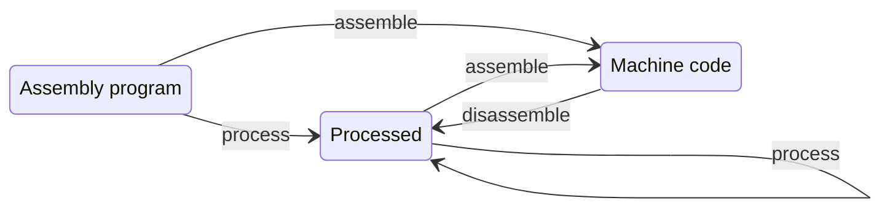

# Visa IS an Assembler

This section documents the visa assembly language as well as the subcommands of
the `visa` executable that relates to processing visa-assembly programs.

## Architecture

To understand what is being manipulated by a visa program, refer to the
documentation on the microprocessor's [architecture](./circuit.md).

## Assembly

Visa-assembly is the assembly language used to write programs that can be
executed on the visa microprocessor. A visa program is meant to be compiled down
to a mere sequence of instructions. The language allows to jump between executable
addresses (`jump` is sometimes named `goto` in similar languages).

The visa-assembly language is close to the low-level binary executable that the
microprocessor understands, however it has a few higher level constructs to make
developing visa programs easier, namely:

1. Constants
2. Named labels
3. Macros.

These constructs are to be understood as simple pre-processing tools, and are
statically expanded during the assembly phase.

### Instructions

In this section you'll find the microprocessor instructions, with their expected arguments, and meaning.


| Instruction           | Meaning                                     | Number of Bytes |
|-----------------------|---------------------------------------------|-----------------|
| nop                   | Do nothing                                  | 1               |
| sleep                 | Standby until the next second               | 1               |
| add                   | R1 \<- R0 + R1                               | 1               |
| and                   | R1 \<- Bitwise And (R0, R1)                  | 1               |
| swc                   | Switch the contents of R0 and R1            | 1               |
| cmp                   | R1 \<- ( R0 == R1 ) ? 1 : 0                  | 1               |
| not R                 | R \<- Bitwise Not R                          | 1               |
| gof                   | R1 \<- Overflow_flag                         | 1               |
| jmp @LABEL            | Jump to label                               | 2               |
| jmn @LABEL            | Jump to label if ( R1 != 0 )                | 2               |
| jmz @LABEL            | Jump to label if ( R1 == 0 )                | 2               |
| store R, N            | Store contents of register R at address N   | 2               |
| write R, N            | Write contents of register R at address N in the output device | 2 |
| load N, R             | Load address N into register R              | 2               |
| load #V, R            | Load the value V into register R            | 2               |

Below is the definition of the instructions along with their expected arguments,
as defined in the source code of visa.

<!-- $MDX file=instruction.ml,part=instructions -->
```ocaml
  | Nop
  | Sleep
  | Add
  | And
  | Swc
  | Cmp
  | Not of { register_name : Register_name.t }
  | Gof
  | Jmp of { label : 'label }
  | Jmn of { label : 'label }
  | Jmz of { label : 'label }
  | Store of
      { register_name : Register_name.t
      ; address : Address.t
      }
  | Write of
      { register_name : Register_name.t
      ; address : Address.t
      }
  | Load_address of
      { address : Address.t
      ; register_name : Register_name.t
      }
  | Load_value of
      { value : int
      ; register_name : Register_name.t
      }
```

### Operands

Macros and instructions are applied to arguments of different kinds. Below is
the list of all of them, along with their syntax.

| Kind        | Syntax          | Examples               | Constraints          |
| ----------- | --------------- |------------------------|----------------------|
| Value       | #[0-9]+         | #0, #1, #255           | Between 0 and 255    |
| Address     | [0-9]+          | 0, 1, 255              | Between 0 and 255    |
| Constant    | Alphanumeric    | var, hello, my_const   | -                    |
| Label       | @Alphanumeric   | @LABEL, @loop, @29     | -                    |
| Register    | R0 or R1        | R0, R1                 | -                    |
| Parameter   | $Alphanumeric   | $var, $x42             | -                    |

Below is the definition of the arguments as defined in the source code of visa.

<!-- $MDX file=assembly_instruction.ml,part=arguments -->
```ocaml
    | Value of { value : int }
    | Address of { address : Address.t }
    | Constant of { constant_name : Constant_name.t }
    | Label of { label : Label.t }
    | Register of { register_name : Register_name.t }
    | Parameter of { parameter_name : Parameter_name.t }
```

### Constants

Visa programs can start by defining constant that will be referred to in the
rest of the program. Constants can either be addresses (memory or output-device)
or immediate values. The syntax for each is:

```visa-assembly
// Defining a constant address
define address 123

// Defining a constant value
define value #123
```

Addresses may act as variable names in a program, which can be written to and further modified using load and store.

Let's check out the following example, which defines two variables `a` and `b`
(2 memory addresses), three constant values (1, 2, 4), and do some addition
between them.

<!-- $MDX file=constant.asm -->
```visa-assembly
// Constants can be addresses or values. Let's check it out!
define a 0
define b 1
define one #1
define two #2
define four #4

// a <- one + two
load one, R0
load two, R1
add
store R1, a

// b <- one + two + three
load four, R0
add
store R1, b

// export the values computed to the output device
load a, R0
load b, R1
write R0, 0
write R1, 1
```

### Labels

Labels are location in the code that can be used to jump to, using the
instruction `jmp`, `jmn` and `jmz`. Jump instructions allows to define block of
codes that can be executed multiple times while something in the context is
changing, such as registers or memory. Lets's check below an example of a loop
that implements a counter on the output device address 0.

<!-- $MDX file=loop.asm -->
```visa-assembly
LOOP:
  load #1, R0
  add
  write R1, 0
  jmp @LOOP
```

### Macros

Macro act like functions, which allows one to define block of codes that can be
re-used. Macro are defined using a unique name, introduces parameters, and
define a body that is a list of instructions. Macros are expanded statically
during the processing of an assembly program, which means that their body is
inlined into the resulting executable, after substituting the parameters by
their effective values at call site.

The syntax to define a macro is as follows:

```visa-assembly
macro macro_name param1[, paramN]*
  <body>
end
```

Below we look at an example program that defines a macro called `minus` that
computes the subtraction between 2 immediate values, and store its result into
the `R1` register. The macro is invoked twice with different arguments.

<!-- $MDX file=minus.asm -->
```visa-assembly
// Define a macro that computes [a - b] and stores the result into R1
macro minus a, b
  load $b, R0
  not R0
  load #1, R1
  add
  swc
  load $a, R1
  add
end

// Invoke the minus macro with some parameters
minus #15, #7
// Export the result to the output-device at address 0
write R1, 0

// Invoke the minus macro with other parameters
minus #185, #57
// Export the result to the output-device at address 1
write R1, 1
```

### Embedded DSL

The Visa project contains a library named `Visa_dsl` which allows you to use
OCaml rather than the concrete syntax of visa-assembly to define visa programs.

You may get less precise error locations doing this, but on the other hand, this
allows you to get the full power of your favorite hosting language to manipulate
and generate visa instructions.

We thought it was a fun addition to the project while exploring different
designs and ways assembly programs may be written.

Let's check out a simple example. We are going to rewrite the small loop
executable that we used to illustrate labels in the section above.

<!-- $MDX file=test__visa_dsl.ml,part=program -->
```ocaml
let loop () : Visa.Program.t =
  Visa_dsl.program (fun t ->
    let open Visa_dsl.O in
    let loop = add_new_label t "LOOP" in
    load_value t (value 1) R0;
    add t;
    write t R1 (output 0);
    jmp t loop)
;;
```

Once you've defined a program that way, you may materialize it into a
visa-assembly program written in concrete syntax, as it is done in the expect
test below:

<!-- $MDX file=test__visa_dsl.ml,part=loop-pp -->
```ocaml
let%expect_test "loop pp" =
  let program = loop () in
  print_endline (Pp_extended.to_string (Visa_pp.Program.pp program));
  [%expect {|
    LOOP:
      load #1, R0
      add
      write R1, 0
      jmp @LOOP |}]
;;
```

The visa libraries also contain utils to run programs constructed that way (or
parsed from concrete syntax) in the command line or in unit tests. In the
example below, we simulate the execution of the loop program for enough cycles
to generate 20 different outputs.

<!-- $MDX file=test__visa_dsl.ml,part=loop-run -->
```ocaml
let%expect_test "loop run" =
  let program = loop () in
  let config = Visa_simulator.Config.create ~sleep:false ~stop_after_n_outputs:20 () in
  Error_log.For_test.report (fun error_log ->
    let%bind visa_simulator = Visa_simulator.create ~config ~error_log ~program in
    Visa_simulator.run visa_simulator ~error_log);
  [%expect
    {|
    1000000000000000000000000000000000000000000000000000000000000000
    0100000000000000000000000000000000000000000000000000000000000000
    1100000000000000000000000000000000000000000000000000000000000000
    0010000000000000000000000000000000000000000000000000000000000000
    1010000000000000000000000000000000000000000000000000000000000000
    0110000000000000000000000000000000000000000000000000000000000000
    1110000000000000000000000000000000000000000000000000000000000000
    0001000000000000000000000000000000000000000000000000000000000000
    1001000000000000000000000000000000000000000000000000000000000000
    0101000000000000000000000000000000000000000000000000000000000000
    1101000000000000000000000000000000000000000000000000000000000000
    0011000000000000000000000000000000000000000000000000000000000000
    1011000000000000000000000000000000000000000000000000000000000000
    0111000000000000000000000000000000000000000000000000000000000000
    1111000000000000000000000000000000000000000000000000000000000000
    0000100000000000000000000000000000000000000000000000000000000000
    1000100000000000000000000000000000000000000000000000000000000000
    0100100000000000000000000000000000000000000000000000000000000000
    1100100000000000000000000000000000000000000000000000000000000000
    0010100000000000000000000000000000000000000000000000000000000000 |}];
  ()
;;
```

More information on simulating visa program can be found in the documentation of
the visa simulator.

## Visa commands

The Visa project comes along with commands to manipulate visa programs,
including commands to check for errors, process the files to target their
execution, a simulator, a debugger, an assembler and a disassembler.

For the sake of the example here, we'll use the program `minus.asm` which we
used to illustrate the section on macros above.

<details open>
<summary>
Contents of minus.asm
</summary>

<!-- $MDX file=minus.asm -->
```visa-assembly
// Define a macro that computes [a - b] and stores the result into R1
macro minus a, b
  load $b, R0
  not R0
  load #1, R1
  add
  swc
  load $a, R1
  add
end

// Invoke the minus macro with some parameters
minus #15, #7
// Export the result to the output-device at address 0
write R1, 0

// Invoke the minus macro with other parameters
minus #185, #57
// Export the result to the output-device at address 1
write R1, 1
```
</details>

### Checker

Visa assembly program can be validated with the command `visa check`, which will
parse and check the program, and exit 1 in case the program is detected to be
statically invalid.

For example, let's consider the following program `invalid-arguments.asm`, which
contain several errors.
<!-- $MDX file=invalid-arguments.asm -->
```visa-assembly
nop
nop #1
add #1
not $r
store R0, @label
jmp @label
```

Let's check it using `visa check`:

```sh
$ visa check invalid-arguments.asm
File "invalid-arguments.asm", line 2, characters 0-3:
2 | nop #1
    ^^^
Error: ("Invalid number of arguments"
 ((instruction_name NOP) (expects 0) (is_applied_to 1)))
File "invalid-arguments.asm", line 3, characters 0-3:
3 | add #1
    ^^^
Error: ("Invalid number of arguments"
 ((instruction_name ADD) (expects 0) (is_applied_to 1)))
File "invalid-arguments.asm", line 4, characters 4-6:
4 | not $r
        ^^
Error: ("Unbound parameter" ((parameter_name r)))
File "invalid-arguments.asm", line 5, characters 10-16:
5 | store R0, @label
              ^^^^^^
Error: ("Invalid argument"
 ((instruction_name STORE) (arg 2) (expected Address)
  (applied_to (Label (label label)))))
File "invalid-arguments.asm", line 6, characters 4-10:
6 | jmp @label
        ^^^^^^
Error: ("Undefined label" ((label label)))
[1]
```

On the other hand, `minus.asm` is a valid program, so the check command silently
exit 0 on it:

```sh
$ visa check minus.asm
```

### Processor

Processing a visa assembly program with the command `visa process` will parse
and check the program, and then it will pretty-print a version of the program
where all macros have been expanded, and all named labels have been resolved to
their runtime numerical value.

```sh
$ visa process minus.asm
load #7, R0
not R0
load #1, R1
add
swc
load #15, R1
add
write R1, 0
load #57, R0
not R0
load #1, R1
add
swc
load #185, R1
add
write R1, 1
```

The resulting program is very close to the final binary representation that can
be fed directly to the microprocessor (there just remains the mapping to machine
code for each instruction).

This intermediate representation can be used in regression tests, for example if
you want to make some refactoring using macros and constants, while verifying
that the expanded version of the program did not change.

### Simulator

As you're developing new assembly program, you may be interested in checking
their execution before executing them on the actual hardware. `visa run` is a
software simulator that can be used for that purpose. It processes an assembly
program supplied in the command line, and execute it. It prints on stdout the
value of the output device of the microprocessor every time it changes.

```sh
$ visa run minus.asm
0001000000000000000000000000000000000000000000000000000000000000
0001000000000001000000000000000000000000000000000000000000000000
```

As a reminder, our testing program minus.asm was computing first `15-7=8`,
writing that result to output 0, and outputting `185-57=128` to output 1. Thus,
the program only write to the first 16 bits of the output device, writing to its
first byte fist and to the second then. If we cut down the output to the first
two bytes, we can indeed see that the resulting bits for the output 0 and 1 are
respectively 0010000 (8) and 00000001 (128).

```sh
$ visa run minus.asm | cut -c 1-16
0001000000000000
0001000000000001
```

### Debugger

To help debugging visa programs we implemented a graphical debugger that allows
you to execute visa programs step by step, while monitoring the state of the
memory and the registers. You can also tweak the values of the registers while
the program is running, in order to force some jumps, or impact in some other
way the execution.

To run:

<!-- $MDX skip -->
```sh
$ visa-debugger bogue minus.asm
```

<p>
  
</p>

The debugger is pretty basic and experimental, but it turned out to be a
valuable asset while working on some refactoring on the `calendar.asm` program,
so we decided to include it to the project deliverables. It is implemented with
[bogue](https://github.com/sanette/bogue), so perhaps in fact, we can call it
the visa-deboguer.

:::tip

Note that you may be interested in debugging a program that is provided in its
binary format. For that, you'll need to disassemble it first, to obtain a `.asm`
version of it which you can supply to the debugger.

:::

### Assembler

The assembler phase allows you to translate assembly programs to machine code
that can be executed on the visa microprocessor.

For a reference of instruction machine codes, see below:

<!-- $MDX file=test__machine_code.ml,part=machineCodes -->
```ocaml
    {|
              Nop : 00000000 - opcode=00
            Sleep : 10000000 - opcode=01
              Add : 01000000 - opcode=02
              And : 11000000 - opcode=03
              Swc : 00100000 - opcode=04
              Cmp : 10100000 - opcode=05
           Not_R0 : 01100000 - opcode=06
           Not_R1 : 01101000 - opcode=06
              Gof : 11100000 - opcode=07
              Jmp : 00010000 - opcode=08
              Jmn : 10010000 - opcode=09
              Jmz : 01010000 - opcode=10
         Store_R0 : 11010000 - opcode=11
         Store_R1 : 11011000 - opcode=11
          Load_R0 : 00110100 - opcode=12
          Load_R1 : 00111100 - opcode=12
    Load_value_R0 : 00110000 - opcode=12
    Load_value_R1 : 00111000 - opcode=12 |}];
```

It's worth noting that while some instructions do not take any argument (nop,
sleep, etc.), some instructions expects an extra operand (such as jumps, load,
store, etc.). As a result, some instructions are encoded on 1 byte, while other
occupy 2 bytes. This information is documented on the Instructions section of
this page.

```sh
$ visa assemble minus.asm
00110000
11100000
01100000
00111000
10000000
01000000
00100000
00111000
11110000
01000000
11011000
00000001
00110000
10011100
01100000
00111000
10000000
01000000
00100000
00111000
10011101
01000000
11011000
10000001
```

### Disassembler

If you have a binary visa executable but no longer have access to the source
`.asm` file, fear not! You can recreate an assembly program that yields the same
binary if re-assembled.

Note that when processing a program, you loose the human readable names of the
labels used by the jump instructions, as well as loose the macros that may have
been part of the original program. As a result, disassembling a program may not
give you exactly what you started from.

The diagram below shows you what you can expect when working with visa-assembly
programs while using the different commands:


